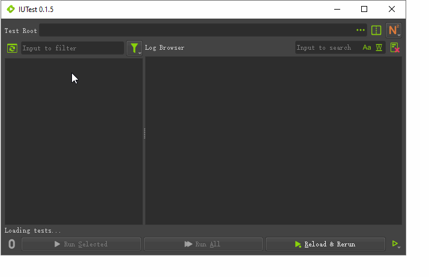

[](https://codecov.io/gh/mgland/iutest)
[](https://sonarcloud.io/dashboard?id=mgland_iutest)

 
 


[logo]: ./iutest/icons/iutest.svg "IUTest Logo"

# ![logo] IUTest
"IUTest" stands for "Interactive UnitTest", it is an interactive python unit-test runner that aims to support various unit-test frameworks like
[nose2](https://pypi.org/project/nose2/), [pytest](https://pypi.org/project/pytest/), etc.

It has a pretty yummy Chinese name "[Youtiao](https://en.wikipedia.org/wiki/Youtiao)", which is Chinese fried breadstick typically for breakfast :)

 

### To install IUTest
```shell
# For system default python or virtual env
pip install iutest

# For pipenv python
pipenv install iutest
```

### IUTest Command Line Interface
```shell
# Get version:
iutest --version

# Run IUTest UI:
iutest
# or
iutest --ui

# Run all tests recursively within a directory:
iutest --runner "nose2" --runTests "E:/projects/iutest"

# Run tests by python module paths:
iutest --runner "nose2" --runTests "iutest.tests.test_dummypyunits" --runTests "iutest.tests.iutests"

# Run test but stop at first error / failure:
iutest --runner "nose2" --runTests "iutest" --stopOnError
```

### Run tests in python
```python
import sys
testerPath = 'E:/projects/iutest'  # Change to your path!
if testerPath not in sys.path:
    sys.path.append(testerPath)
    
import iutest
# Run all tests under given file system path:
iutest.runTests("nose2", 'path/To/Test/RootDir')

# Run tests by given python module paths:
iutest.runTests("nose2", "iutest.tests.test_dummytests", "iutest.tests.iutests")
```

### Run UI in python
```python
import sys
testerPath = 'E:/projects/iutest'  # Change to your path!
if testerPath not in sys.path:
    sys.path.append(testerPath)
    
import iutest
iutest.runUi()
```

### Run IUTest in DCC application, e.g. [Maya](https://www.autodesk.com.au/products/maya)
It is easy to use [pip with Maya](http://mgland.com/qa/en/?qa=1748/how-to-use-pip-with-maya), with pip available in mayapy, you just need to do `mayapy -m pip install packageName` for each package we need: iutest, reimport, nose2 or pytest.

However, pip requires root privilege and it did introduce many potential risks, so to use iutest in Maya without pip:
- Download [IUTest](https://pypi.org/project/iutest/) and its dependency libraries:
  [reimport](https://pypi.org/project/reimport/), [nose2](https://pypi.org/project/nose2/) or [pytest](https://pypi.org/project/pytest/)
- Make these libraries available to Maya by adding their paths to `sys.path`.
- Install the [code](#Run-UI-in-python) above as a Maya shelf button.
- Click on the shelf button to run IUTest UI.
